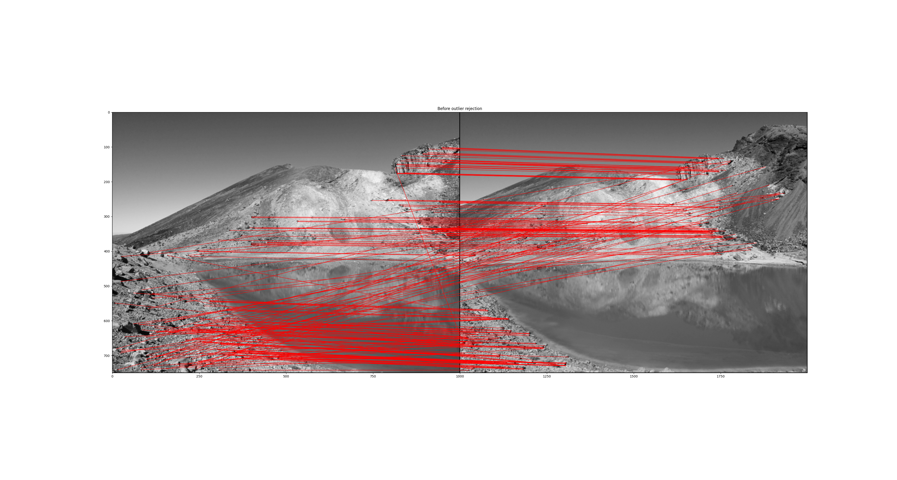

# COMPSCI 773 Assignment 1: Berg, N. & Loh, N.

## Author

<table>
  <tr>
    <th>Name</th>
    <th>Email</th>
    <th>Github Username</th>
    <th>Student Number</th>
  </tr>
  <tr>
    <td>Nicholas Berg</td>
    <td> nber106@aucklanduni.ac.nz </td>
    <td>133caesium</td>
    <td>579246262</td>
  </tr>
  <tr>
    <td>Neville Loh</td>
    <td>nloh108@aucklanduni.ac.nz</td>
    <td>Neville-Loh</td>
    <td>737025829</td>
  </tr>
</table>


A basic image stitching program written by Neville Loh and Nicholas Berg.

# Arguments and Usage


## Linux/Mac
```
python3 CS773StitchingSkeleton.py
```

## Windows
```
python CS773StitchingSkeleton.py
```

Running the main file without arguments will result in the default image being stich to gether


## Requirement
Python 3.8 or above, for dependancy, please refer to requirement.txt


## Usage
```
usage: python3 CS773StitchingSkeleton.py [-h] [-n N_CORNER] [-a ALPHA] [-w WINSIZE]
               [-ph PLOT_HARRIS_CORNER] [-fds FEATURE_DESCRIPTOR_PATCH_SIZE]
               [-fdt FEATURE_DESCRIPTOR_THRESHOLD]
               [-or ENABLE_OUTLIER_REJECTION] [-orm OUTLIER_REJECTION_STD]
               input input2
```
## Arguments
### Quick reference table
|Short |Long                             |Default|Description                                                                                                                                                                                                                                                                                        |
|------|---------------------------------|-------|---------------------------------------------------------------------------------------------------------------------------------------------------------------------------------------------------------------------------------------------------------------------------------------------------|
|`-h`  |`--help`                         |       |show this help message and exit                                                                                                                                                                                                                                                                    |
|`-n`  |`--n_corner`                     |`1000` |Number of corner output by the algorithm. The output image will contain n corners with the strongest response. If nothing is supplied, default to 1000                                                                                                                                             |
|`-a`  |`--alpha`                        |`0.04` |The Harris Response constant alpha. Specifies the weighting between corner with strong with single direction and multi-direction. A higher alpha will result in less difference between response of ingle direction and multi-direction shift in intensity. If nothing is supplied, default to 0.04|
|`-w`  |`--winsize`                      |`5`    |Gaussian windows size which applied the the squared and mix derivative of the image.A higher windows size will result in higher degree of smoothing, If nothing is supplied, the default widows size is set to 5.                                                                                  
|`-ph` |`--plot_harris_corner`           |`False`       |Plot the Harris corner response. If nothing is supplied, the default is set to False                                                                                                                                                                                                               |
|`-fds`|`--feature_descriptor_patch_size`|`15`   |The size of the feature descriptor patch. If nothing is supplied, the default patch size is set to 15.                                                                                                                                                                                             |
|`-fdt`|`--feature_descriptor_threshold` |`0.9`  |The threshold of the feature descriptor. If nothing is supplied, the default threshold is set to 0.9                                                                                                                                                                                               |
|`-or` |`--enable_outlier_rejection`     |`True`       |Enable outlier rejection. If nothing is supplied, the default is set to True                                                                                                                                                                                                                       |
|`-orm`|`--outlier_rejection_std`        |`1`    |The outlier rejection standard deviation to include. If nothing is supplied, the default is set to 1                                                                                                                                                                                               |


### Example call with arguments
```
python3 CS773StitchingSkeleton.py images/panoramaStitching/oxford_left_berg_loh_01.png images/panoramaStitching/oxford_right_berg_loh_01.png -n 2000
```


## Results:

### Main Task: Normalized Cross Correlation (NCC) based brute force matching using a precomputed axis-aligned descriptor.




### Extension 1: Optimisation of the NCC Matching
We performed a number of performance optimisations to decrease runtime of our NCC. 
Additionally, using the intuition that our panoramas would be unlikely to experience drastic rotation around the z axis, 
we made the assumption that the length and gradiant of the lines connecting features should be tightly distributed. We used 
statistical anaylsis to design a filtering step which significiantly improves signal to noise (reducing false positive matches without
reducing true positive matches). Additionally, we combined our low level implementation of NCC with an existing implementation of NCC
based on Solem (2012)'s Computer Vision textbook. Finally, we performed "sanity checks" by testing our system on three different pairs of images, 
and checking the extent to which unrelated images would be mapped, or similarly the extent to which two identical images are mapped. Lines have been plotted in distinct colour to better visually
identify true and false positive matches.


### Extension 2: Comparison with HOG feature detector.
As our second extension, we researched implementations of Histogram of Oriented gradients, and combined and modified 
existing implementations of the HOG feature detector to fit into our workflow, allowing comparison
with our existing image sets. 


### Extension 3: Comparison with SIFT feature detector.
As our third extension, we utilised the VLFeat open source library to more easily implement a SIFT feature detector. 
This implementation was used to perform the same tests as our two NCC implementations and HOG implementation, for a comparison
of different feature detectors across a common image set.


