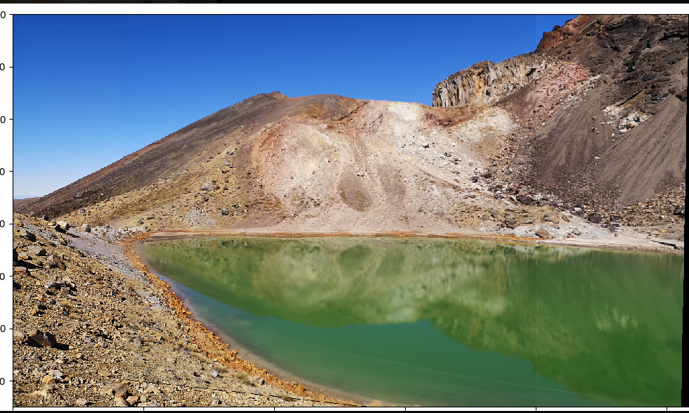
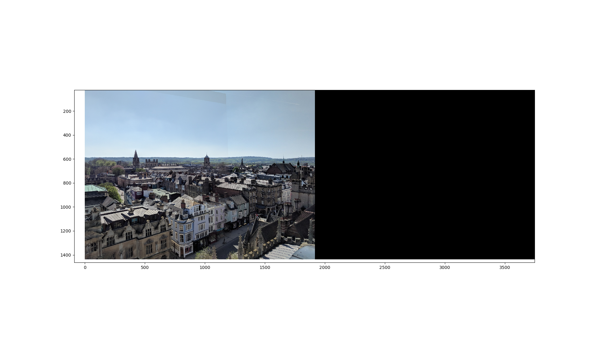
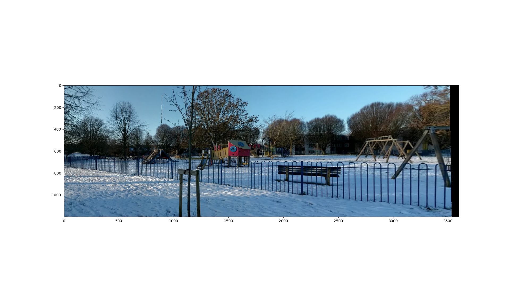
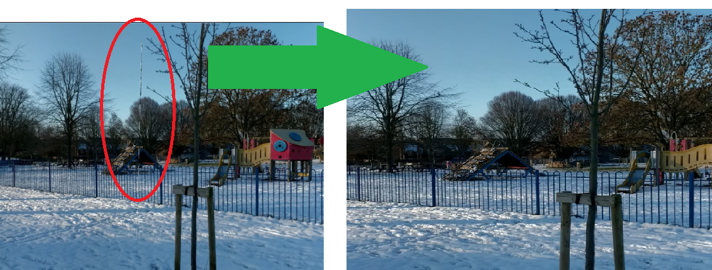
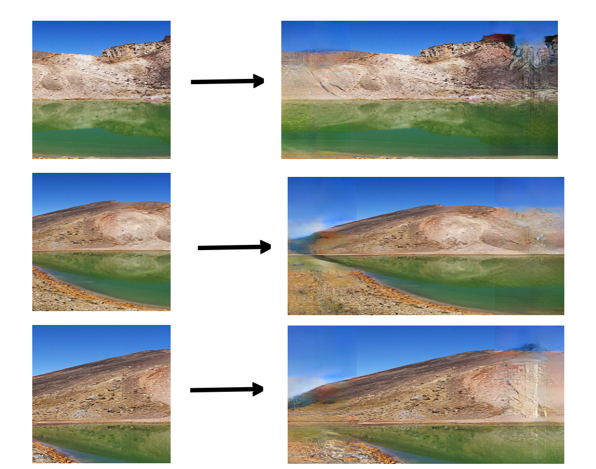
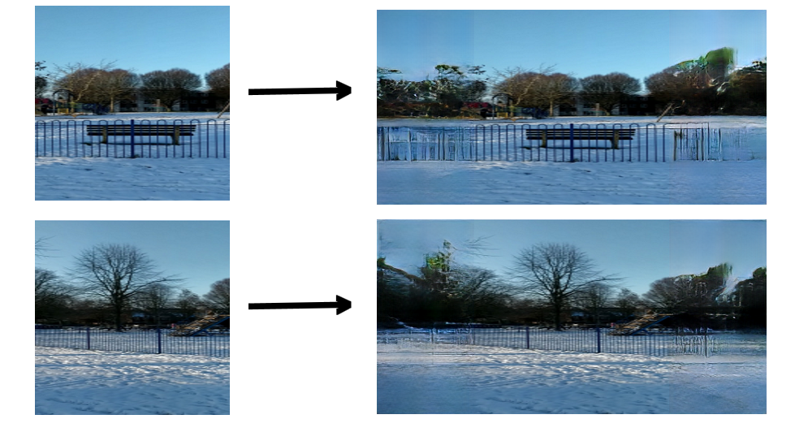
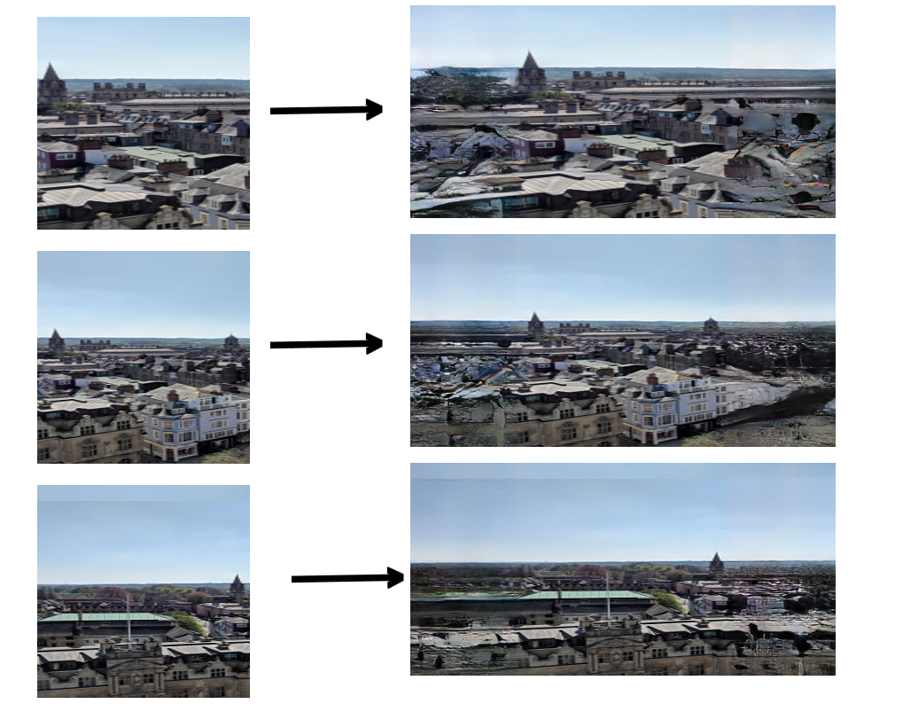
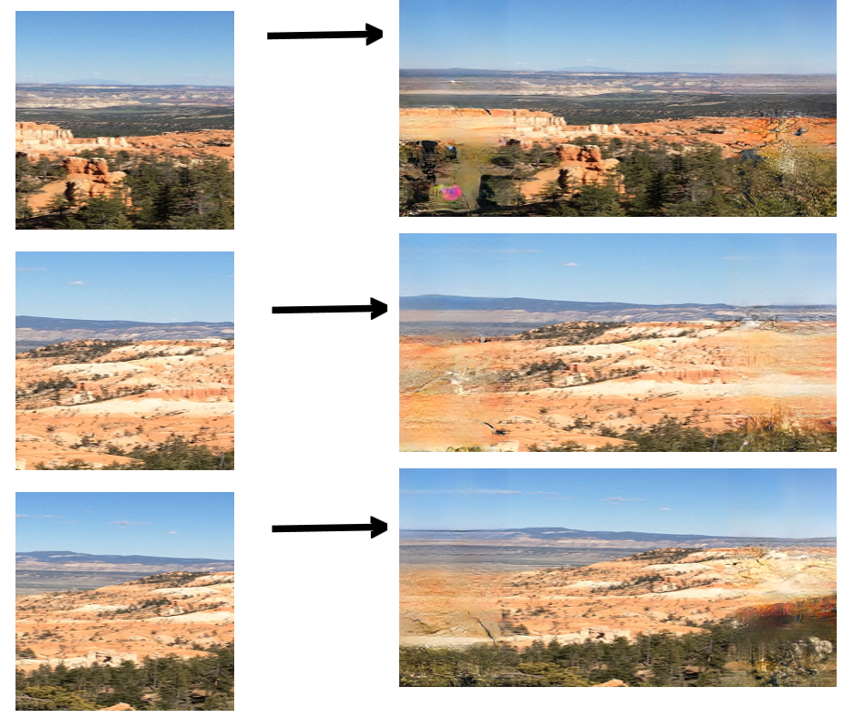

# COMPSCI 773 Assignment 1: Berg, N. & Loh, N.

## Author

<table>
  <tr>
    <th>Name</th>
    <th>Email</th>
    <th>Github Username</th>
    <th>Student Number</th>
  </tr>
  <tr>
    <td>Nicholas Berg</td>
    <td> nber106@aucklanduni.ac.nz </td>
    <td>133caesium</td>
    <td>579246262</td>
  </tr>
  <tr>
    <td>Neville Loh</td>
    <td>nloh108@aucklanduni.ac.nz</td>
    <td>Neville-Loh</td>
    <td>737025829</td>
  </tr>
</table>


A basic image stitching program written by Neville Loh and Nicholas Berg.

# Arguments and Usage


## Linux/Mac
```
python3 CS773StitchingSkeleton.py
```

## Windows
```
python CS773StitchingSkeleton.py

For the ML extension, the command is:
python ./assignment_three_machine_learning/test.py --dataset 773image_outfill --data_file ./assignment_three_machine_learning/imgs/source_images --load_model_dir ./assignment_three_machine_learning/checkpoints/cityscapes-srn-subpixel-gc64 --model srn --feat_expansion_op subpixel --use_cn 1 --random_crop 0 --random_mask 0 --img_shapes 256,512,3 --mask_shapes 256,256 --g_cnum 64
```

Running the main file without arguments will result in the default image being stich to gether


## Requirement
Python 3.8 or above, for dependancy, please refer to requirement.txt

The trained ML models can be downloaded from this [google drive folder (large files)](https://drive.google.com/drive/u/1/folders/172kTjMeX88gbBmPlYkdYjL0rKfcj3fu6).

The training set can be downloaded from the [places2 website](http://places2.csail.mit.edu/download.html)

## Usage
```
usage: python3 CS773StitchingSkeleton.py [-h] [-n N_CORNER] [-a ALPHA] [-w WINSIZE]
               [-ph PLOT_HARRIS_CORNER] [-fds FEATURE_DESCRIPTOR_PATCH_SIZE]
               [-fdt FEATURE_DESCRIPTOR_THRESHOLD]
               [-or ENABLE_OUTLIER_REJECTION] [-orm OUTLIER_REJECTION_STD]
               input input2
```
# Arguments
## Quick reference table
|Short |Long                             |Default|Description                                                                                                                                                                                                                                                                                        |
|------|---------------------------------|-------|---------------------------------------------------------------------------------------------------------------------------------------------------------------------------------------------------------------------------------------------------------------------------------------------------|
|`-h`  |`--help`                         |       |show this help message and exit                                                                                                                                                                                                                                                                    |
|`-n`  |`--n_corner`                     |`1000` |Number of corner output by the algorithm. The output image will contain n corners with the strongest response. If nothing is supplied, default to 1000                                                                                                                                             |
|`-a`  |`--alpha`                        |`0.04` |The Harris Response constant alpha. Specifies the weighting between corner with strong with single direction and multi-direction. A higher alpha will result in less difference between response of ingle direction and multi-direction shift in intensity. If nothing is supplied, default to 0.04|
|`-w`  |`--winsize`                      |`5`    |Gaussian windows size which applied the the squared and mix derivative of the image.A higher windows size will result in higher degree of smoothing, If nothing is supplied, the default widows size is set to 5.                                                                                  
|`-ph` |`--plot_harris_corner`           |`False`       |Plot the Harris corner response. If nothing is supplied, the default is set to False                                                                                                                                                                                                               |
|`-fds`|`--feature_descriptor_patch_size`|`15`   |The size of the feature descriptor patch. If nothing is supplied, the default patch size is set to 15.                                                                                                                                                                                             |
|`-fdt`|`--feature_descriptor_threshold` |`0.9`  |The threshold of the feature descriptor. If nothing is supplied, the default threshold is set to 0.9                                                                                                                                                                                               |
|`-or` |`--enable_outlier_rejection`     |`True`       |Enable outlier rejection. If nothing is supplied, the default is set to True                                                                                                                                                                                                                       |
|`-orm`|`--outlier_rejection_std`        |`1`    |The outlier rejection standard deviation to include. If nothing is supplied, the default is set to 1                                                                                                                                                                                               |


## Example call with arguments
```
python3 CS773StitchingSkeleton.py images/panoramaStitching/oxford_left_berg_loh_01.png images/panoramaStitching/oxford_right_berg_loh_01.png -n 2000
```


# Results:

## Main Task: Complete Image Stiching with Computed Homography, RANSAC, and Image Warping








## Extension 1: Optimisations and Presentation of Code:
Throughout our development of this image stitching application, we have made several performance and usability enhancements to our codebase to ensure good performance. Particularly for milestone 3, in order to avoid 
recomputing, we have added caching functionalities that allow us to investigate specific parameters without recomputing the entire process. 


## Extension 2: Ghost Removal
As our second extension, we noticed some artefacts were produced that were not a result of the stiching, but rather defects in our source images. This is a common issue in panoramas taken in busy locations as moving people
 across the different photos taken at different time can cause strange "ghost like" artefacts. Building on work by [Uyttendaele et al.](https://www.cs.jhu.edu/~misha/ReadingSeminar/Papers/Uyttendaele01.pdf) we introduced code to minimise and remove these artefacts.


## Extension 3: Extrapolation of images using machine learning.
As our third extension, we considered the case where a photo was taken on a hiking trip, but unfortunately the second panorama image was lost (or not taken) and a panorama was still desirable. 
Given advances in machine learning and the availability of large datasets of landscape images, we hypothesised that it might be possible train an algorithm to 
predict the surrounds of an image. Having researched this topic, we built on work produced by the dvlab, [specficially Wang et al. 2019](https://jiaya.me/papers/imgextrapolation_cvpr19.pdf) by
using their algorithm retrained on the places2 dataset. This produced some relatively convincing interpretations of the surrounds, shown below, and suggests promise for further image enhancement.







## Extension 4: Parameter exploration and optimisation for different subjects.
We continued our work on tuning parameters, by using our previous extension results to optimise the stitching outputs on our test images.


